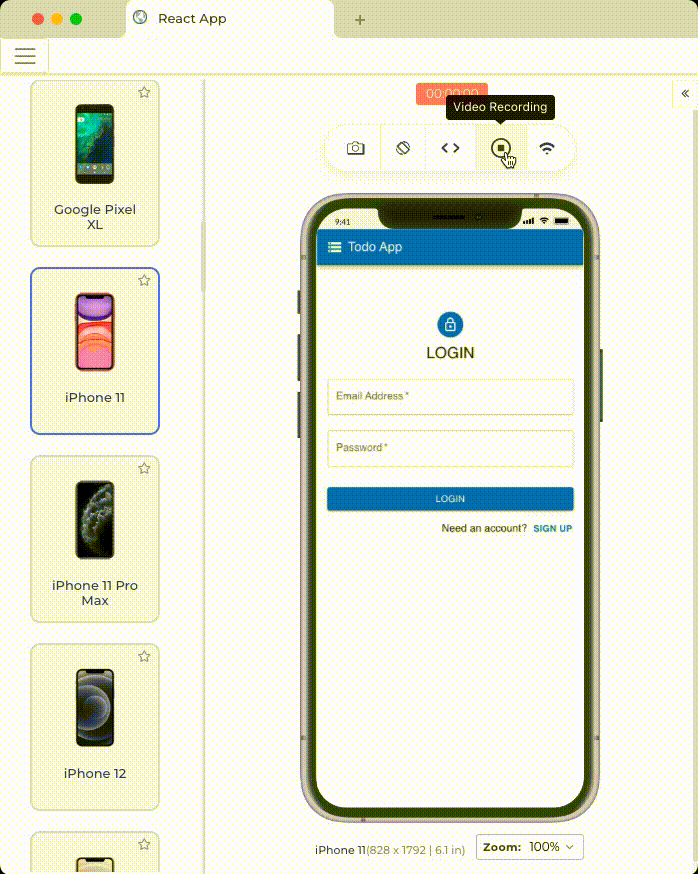
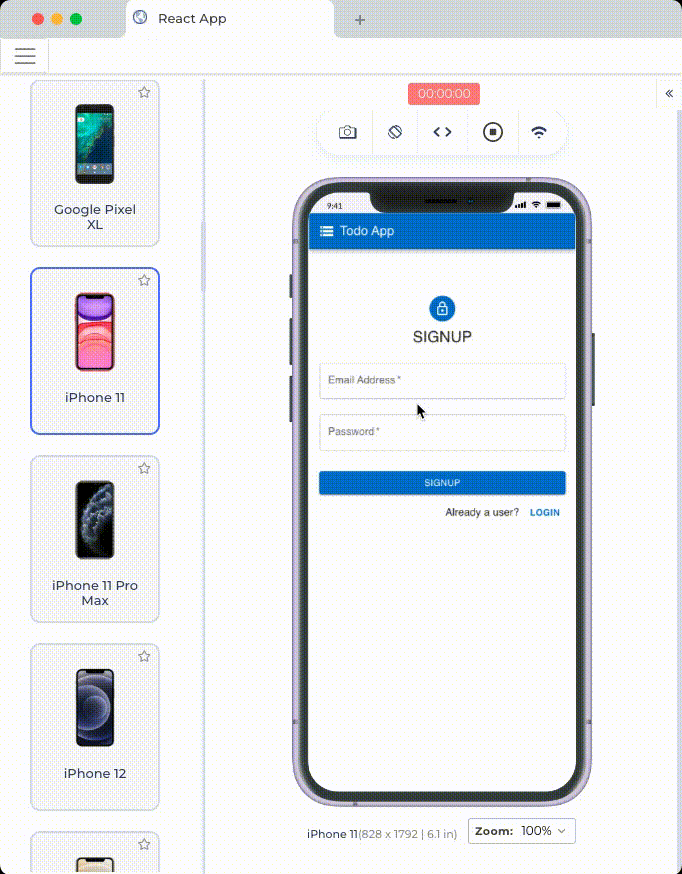
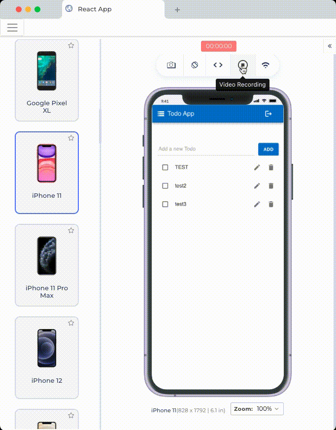
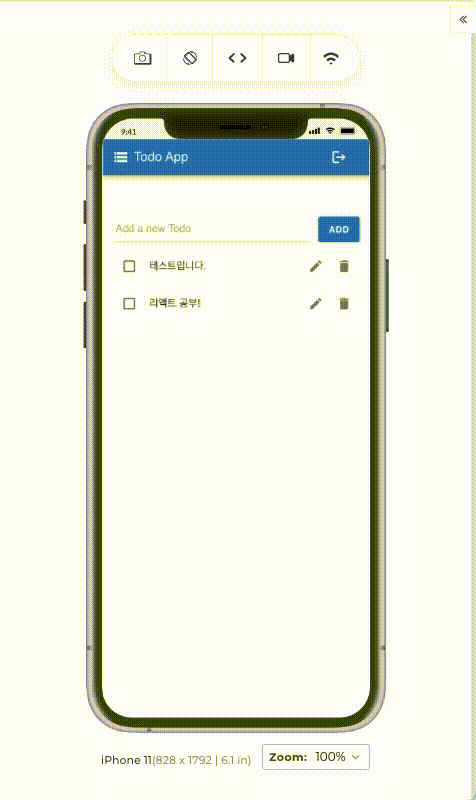
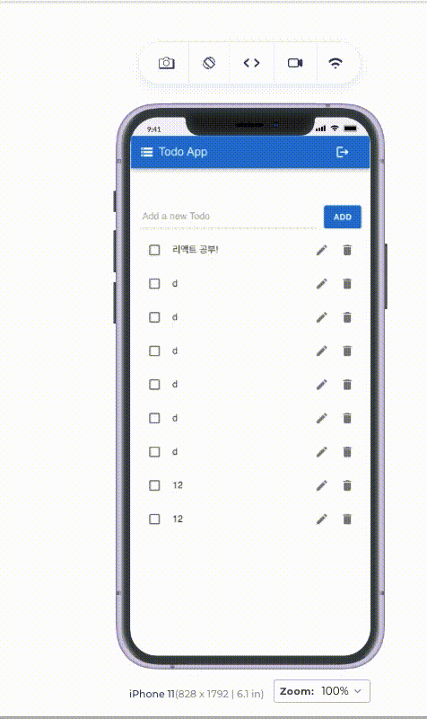

## 원티드 프리온보딩 프론트엔드 - 선발 과제

원티드 프리온보딩 프론트엔드 선발 과제로 제공해주신 API를 이용한 Todo App입니다.
`React` `TypeScript` `react-router-dom` `axios` `react-query` `Material UI`

### 실행 방법

```
yarn install
yarn start
```

`localhost:3000` 접속

### 데모 영상

#### 로그인 / 회원가입

| 회원가입 / 로그인                | 회원가입 유효성 검사             | 로그아웃               |
| -------------------------------- | -------------------------------- | ---------------------- |
|  |  |  |

#### 투두 리스트

| 새로운 투두 추가        | 투두 수정                | 투두 삭제                  |
| ----------------------- | ------------------------ | -------------------------- |
|  |  |  |
