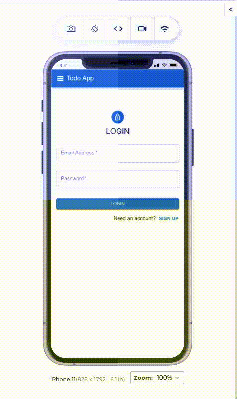

## 원티드 프리온보딩 프론트엔드 - 선발 과제

원티드 프리온보딩 프론트엔드 선발 과제로 제공해주신 [API](https://github.com/walking-sunset/selection-task)를 이용한 Todo App입니다.

`React` `TypeScript` `react-router-dom` `axios` `react-query` `Material UI`

### 순서

- [과제내용](#과제내용)
- [실행방법](#실행방법)
- [데모](#데모)


---


### 과제내용
#### :: 1. 로그인 / 회원가입

- `/` 경로에 로그인 / 회원가입 기능을 개발해주세요
  - 페이지 안에 이메일 입력창, 비밀번호 입력창, 제출 버튼이 포함된 형태로 구성해주세요
  - 로그인, 회원가입을 별도의 경로로 분리해도 무방합니다.

##### Assignment1

- 이메일과 비밀번호의 유효성 검사기능을 구현해주세요
  - 이메일 조건: `@` 포함
  - 비밀번호 조건: 8자 이상
  - 입력된 이메일과 비밀번호가 위 조건을 만족할 때만 버튼이 활성화 되도록 해주세요
  - 보안 상 실제 사용하고 계신 이메일과 패스워드말고 테스트용 이메일, 패스워드 사용을 권장드립니다.

##### Assignment2

- 로그인 API를 호출하고, 올바른 응답을 받았을 때 `/todo` 경로로 이동해주세요
  - 로그인 API는 로그인이 성공했을 시 Response Body에 JWT를 포함해서 응답합니다.
  - 응답받은 JWT는 로컬 스토리지에 저장해주세요

##### Assignment3

- 로그인 여부에 따른 리다이렉트 처리를 구현해주세요
  - 로컬 스토리지에 토큰이 있는 상태로 `/` 페이지에 접속한다면 `/todo` 경로로 리다이렉트 시켜주세요
  - 로컬 스토리지에 토큰이 없는 상태로 `/todo`페이지에 접속한다면 `/` 경로로 리다이렉트 시켜주세요
#### :: 2. 투두 리스트

##### Assignment4

- `/todo`경로에 접속하면 투두 리스트의 목록을 볼 수 있도록 해주세요
- 리스트 페이지에는 투두 리스트의 내용과 완료 여부가 표시되어야 합니다.
- 리스트 페이지에는 입력창과 추가 버튼이 있고, 추가 버튼을 누르면 입력창의 내용이 새로운 투두 리스트로 추가되도록 해주세요

##### Assignment5

- 투두 리스트의 수정, 삭제 기능을 구현해주세요
  - 투두 리스트의 개별 아이템 우측에 수정버튼이 존재하고 해당 버튼을 누르면 수정모드가 활성화되고 투두 리스트의 내용을 수정할 수 있도록 해주세요
  - 수정모드에서는 개별 아이템의 우측에 제출버튼과 취소버튼이 표시되며 해당 버튼을 통해서 수정 내용을 제출하거나 수정을 취소할 수 있도록 해주세요
  - 투두 리스트의 개별 아이템 우측에 삭제버튼이 존재하고 해당 버튼을 누르면 투두 리스트가 삭제되도록 해주세요


---


### 실행방법

```
yarn install
yarn start
```

`localhost:3000` 접속


---


### 데모

#### 로그인 / 회원가입

| 회원가입               | 로그인 / 로그아웃             |
| ---------------------- | ----------------------------- |
|  |  |

#### 투두 리스트

| 새로운 투두 추가        | 투두 수정                | 투두 삭제                  |
| ----------------------- | ------------------------ | -------------------------- |
|  |  |  |
